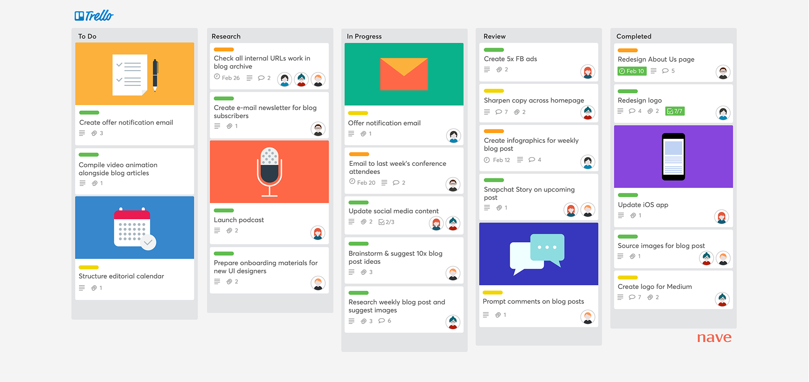

# FINAL-AP-07.2025-TOLEDO
# NullFood

**NullFood** es una aplicación móvil que conecta comercios gastronómicos con consumidores para evitar el desperdicio de alimentos.
La app permite a panaderías, restaurantes, supermercados y otros locales publicar excedentes de comida del día o productos próximos a vencer, a precios accesibles.
El objetivo es reducir el descarte de alimentos, promover el consumo responsable y brindar oportunidades de compra a personas con bajo presupuesto.

## Objetivos SMART
- Reducir en un 30% el volumen de alimentos desechados por los comercios registrados durante los primeros 3 meses de funcionamiento.
- Incorporar al menos 15 comercios adheridos en los primeros 2 meses desde el lanzamiento de la app.

## 6. Análisis de factibilidad

El **análisis de factibilidad** es un proceso que permite evaluar si un proyecto es viable antes de invertir recursos en su desarrollo.  
Sirve para detectar posibles limitaciones, estimar costos, evaluar la disponibilidad de recursos y prever dificultades técnicas u operativas.  
En el caso de **NullFood**, este análisis permite reducir riesgos desde el inicio, optimizar la planificación y tomar decisiones informadas sobre la continuidad o ajustes del proyecto.

Entre las diferentes dimensiones de factibilidad, para este proyecto se analizarían especialmente:

1. **Factibilidad técnica**  
   Evalúa si es posible construir la aplicación con la tecnología, herramientas y conocimientos disponibles.  
   Para NullFood, esto implica analizar si se cuenta con:
   - Un equipo de desarrollo con experiencia en aplicaciones móviles y backend.
   - Infraestructura de servidores para alojar la base de datos y el backend.
   - Conexiones indispensables con servicios externos, como sistemas de cobro en línea, herramientas para ubicar comercios y usuarios en un mapa, y funcionaes para enviar avisos automáticos a los dispositivos móviles.
   - Compatibilidad con distintos dispositivos y sistemas operativos.
   El resultado de este análisis indicará si el desarrollo es factible con los recursos actuales o si es necesario invertir en capacitación o servicios externos.

2. **Factibilidad económica**  
   Determina si el proyecto es financieramente sostenible y rentable.  
   Para NullFood, se evaluarían:
   - Costos de desarrollo, infraestructura, licencias y mantenimiento.
   - Gastos en marketing y adquisición de usuarios.
   - Posibles fuentes de ingresos, como comisiones por venta, suscripciones premium o publicidad.
   - Punto de equilibrio estimado y proyección de retorno de inversión.
   Este análisis permitirá decidir si la relación entre costos y beneficios justifica la ejecución del proyecto.

## 7. Framework o metodología de gestión de proyecto

Para el desarrollo de **NullFood** utilizaría la metodología **Scrum**, ya que es un marco de trabajo ágil que permite gestionar proyectos de forma iterativa e incremental, enfocándose en la entrega temprana y continua de valor al usuario.

**Justificación de la elección:**
Scrum se adapta muy bien a proyectos de desarrollo de software como NullFood, ya que:
- Facilita la adaptación a cambios en los requisitos, algo habitual en startups y proyectos innovadores.
- Permite entregar versiones funcionales de la aplicación en cortos periodos de tiempo (*Sprints*), obteniendo retroalimentación temprana de usuarios y comercios.
- Promueve la comunicación constante entre todos los miembros del equipo, mejorando la coordinación entre desarrolladores, diseñadores y responsables de negocio.
- Integra la revisión y mejora continua del producto mediante reuniones periódicas (*Sprint Review* y *Retrospective*).
- Favorece la priorización de funcionalidades a través del *Product Backlog*, asegurando que se trabaje primero en lo que más valor aporta al proyecto.

**Estructura de trabajo propuesta en Scrum para NullFood:**
- **Sprints** de 2 semanas.
- **Reuniones diarias** (*Daily Scrum*) para seguimiento y resolución de bloqueos.
- **Revisión de Sprint** para mostrar avances y recibir comentarios.
- **Retrospectiva** para identificar oportunidades de mejora en el equipo.
- **Roles definidos**:  
  - *Product Owner*: Encargado de definir la visión del producto y priorizar el backlog.  
  - *Scrum Master*: Facilita el proceso y elimina impedimentos.  
  - *Equipo de desarrollo*: Diseña, construye y prueba las funcionalidades.

Esta metodología permitirá que NullFood evolucione de forma controlada pero flexible, incorporando mejoras continuas y minimizando riesgos asociados a cambios de alcance o necesidades del mercado.

## 8. Gestión de riesgos

La gestión de riesgos consiste en identificar, analizar y priorizar amenazas que puedan afectar el proyecto, para luego planificar y ejecutar acciones que reduzcan su probabilidad o impacto.  
**Estrategia para R01 (fallas en integración de pagos):** Realizar pruebas exhaustivas, usar un proveedor confiable y establecer un entorno de prueba seguro antes del lanzamiento.

## 9. Herramienta de gestión/seguimiento de proyecto

Para el seguimiento y organización del proyecto **NullFood** utilizaría **Trello**, una herramienta visual basada en tableros Kanban que permite gestionar tareas de forma clara y colaborativa.

**Motivos de la elección:**
- Organización visual en columnas (*Por hacer*, *En progreso*, *Hecho*), fácil de comprender por todo el equipo.
- Permite asignar tareas, establecer fechas límite y añadir comentarios o adjuntos.
- Facilita el trabajo remoto y la sincronización entre desarrolladores, diseñadores y PM.
- Accesible desde cualquier dispositivo y con versión gratuita suficiente para el alcance del proyecto.

**Ejemplo de uso para NullFood:**
- **Columna “Por hacer”**: Lista de funcionalidades pendientes (registro, pasarela de pagos, geolocalización).
- **Columna “En progreso”**: Funciones actualmente en desarrollo.
- **Columna “Hecho”**: Funciones completadas y listas para pruebas.

